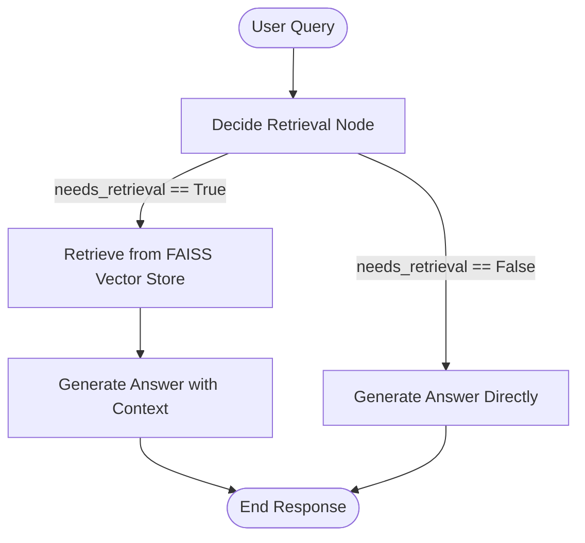

# AI & Machine Learning Portfolio (AI-ML)

Welcome to the **AI-ML** repository. This repository serves as a comprehensive portfolio of practical projects, implementations, and experiments covering a wide spectrum of Artificial Intelligence and Machine Learning. The portfolio spans traditional statistical modeling and machine learning, generative AI, retrieval-augmented generation (RAG), stateful chatbots, and advanced agentic architectures leveraging LangGraph and the Model Context Protocol (MCP).

---

## 🔍 Table of Contents

1. [📊 Core Machine Learning & Data Science](#-core-machine-learning--data-science)
   - [Customer Churn Analysis](#customer-churn-analysis)
   - [California Housing Price Regression](#california-housing-price-regression)
2. [🤖 Agentic Workflows & Multi-Agent Systems](#-agentic-workflows--multi-agent-systems)
   - [Part 1: Model Context Protocol (MCP) Server-Client Setup](#part-1-model-context-protocol-mcp-server-client-setup)
   - [Part 2: Multi-Agent Architectures with LangGraph](#part-2-multi-agent-architectures-with-langgraph)
3. [✨ Generative AI & Multimodal Vision](#-generative-ai--multimodal-vision)
4. [📚 Agentic Retrieval-Augmented Generation (RAG)](#-agentic-retrieval-augmented-generation-rag)
5. [💬 Stateful Agentic Chatbot](#-stateful-agentic-chatbot)
6. [🛠️ Tech Stack & Dependencies](#%EF%B8%8F-tech-stack--dependencies)
7. [⚙️ Installation & Usage](#%EF%B8%8F-installation--usage)

---

## 📊 Core Machine Learning & Data Science

Located in the root of the repository, these projects focus on classical data exploration, feature engineering, statistical modeling, and model validation.

### Customer Churn Analysis
* **Files:** [`ChurnAnalysis.ipynb`](file:///c:/Users/Maviya%20Shaikh/Desktop/agentic_sd/AI-ML/ChurnAnalysis.ipynb), `Churn Analysis Summary.docx`
* **Focus:** Exploratory Data Analysis (EDA) and data cleansing for predicting telecom customer churn.
* **Key Steps:**
  - Standardizing target/features, handling null values, and converting whitespace entries in `TotalCharges` into numeric data.
  - Converting variables (e.g., `SeniorCitizen` numeric markers) into readable categories.
  - Extensive seaborn/matplotlib categorical and numerical distributions (gender, partner, contract types, tech support, etc.) against Churn.

### California Housing Price Regression
* **File:** [`Regression.ipynb`](file:///c:/Users/Maviya%20Shaikh/Desktop/agentic_sd/AI-ML/Regression.ipynb)
* **Focus:** Building predictive models for continuous values using the California Housing dataset.
* **Algorithms & Preprocessing:**
  - Feature scaling using `StandardScaler`.
  - Linear Regression, Ridge Regression (using `GridSearchCV` for hyperparameter tuning), and Lasso Regression.
  - Evaluation using cross-validation Mean Squared Error (MSE), R-squared ($R^2$) metric, and residual analysis.

---

## 🤖 Agentic Workflows & Multi-Agent Systems

Located in the [`AGENTIC/`](file:///c:/Users/Maviya%20Shaikh/Desktop/agentic_sd/AI-ML/AGENTIC) directory, this section focuses on building autonomous, tool-using agents using modern LLM orchestration layers.

### Part 1: Model Context Protocol (MCP) Server-Client Setup
Implements a decoupled architecture where models interact with local systems via standardized protocol servers.
* **`mathserver.py`**: A `FastMCP` server hosting mathematical calculation tools (`add`, `multiply`) over standard input/output (`stdio`).
* **`weather.py`**: A `FastMCP` server exposing a simulated location-based weather utility.
* **`client.py`**: Orchestrates `MultiServerMCPClient` from `langchain-mcp-adapters` to bind the Groq chat LLM (`ChatGroq`) with tools dynamically, enabling a ReAct (Reasoning and Acting) loop.
* **`basic.ipynb` / `react.ipynb`**: Interactive notebook prototypes developing and testing single-agent tool routing capabilities.

### Part 2: Multi-Agent Architectures with LangGraph
* **File:** `AGENTIC/PART2/multi.ipynb`
* **Focus:** Designing stateful multi-agent systems. Using LangGraph to build complex agentic flows where multiple sub-agents specialize in different tasks, exchange messages, and route control conditionally.

---

## ✨ Generative AI & Multimodal Vision

Located in the [`GENAI/`](file:///c:/Users/Maviya%20Shaikh/Desktop/agentic_sd/AI-ML/GENAI) directory, this module leverages Google's Gemini models for text and visual reasoning.
* **`genai/intro.ipynb`**: Introduction to generative model prompting, structured outputs, and agentic API calls using Google Generative AI bindings.
* **`genai/rwvision.ipynb`**: Advanced multi-modal visual processing tasks, demonstrating how to prompt models using image inputs alongside text instructions for automated categorization and visual Q&A.

---

## 📚 Agentic Retrieval-Augmented Generation (RAG)

Located in the [`agentic_RAG/`](file:///c:/Users/Maviya%20Shaikh/Desktop/agentic_sd/AI-ML/agentic_RAG) directory, this project introduces a decision-making agent within a RAG pipeline.
* **File:** `agentic_RAG/eg.ipynb`
* **Architecture:**
  - Rather than retrieving documents naively for every prompt, the LangGraph system begins with a `decide` state node.
  - An heuristic router analyzes the user prompt to determine if retrieval is required.
  - If `needs_retrieval` is evaluated as True, it query-maps vectors in a local `FAISS` database (embedded using `OpenAIEmbeddings`) and returns relevant document nodes.
  - The context-augmented prompt is then synthesized by a generative model (`gpt-4.1`). If retrieval isn't needed, it bypasses the database to save tokens and latency.



---

## 💬 Stateful Agentic Chatbot

Located in the [`agentic_chatbot/`](file:///c:/Users/Maviya%20Shaikh/Desktop/agentic_sd/AI-ML/agentic_chatbot) directory, this is an implementation of an interactive assistant.
* **File:** `agentic_chatbot/first.ipynb`
* **Components:**
  - **State Management:** Employs LangGraph's state machine with message list append reducers (`add_messages`).
  - **Tool API Integration:** Equips the model with search, research, and encyclopedia lookup tools (Arxiv, Wikipedia, and Tavily Search).
  - **Routing Logic:** Evaluates tool calls using `tools_condition`. If a tool is requested, execution routes to a `ToolNode` and circles back to the model node; otherwise, execution terminates, providing a robust interactive search and chat interface.

---

## 🛠️ Tech Stack & Dependencies

The repository utilizes modern data science libraries and agent frameworks:
- **ML / Data Science:** `pandas`, `numpy`, `scikit-learn`, `seaborn`, `matplotlib`, `plotly`
- **Agent Orchestration:** `langgraph`, `langchain`, `langchain-community`
- **LLM Adapters & APIs:** `langchain-groq`, `langchain-google-genai`, `langchain-openai`, `langchain-ollama`
- **MCP Infrastructure:** `mcp`, `langchain-mcp-adapters`
- **Vector Search:** `faiss-cpu` / `faiss-gpu`
- **Environment & APIs:** `python-dotenv`, Groq API, OpenAI API, Gemini API, Tavily API

---

## ⚙️ Installation & Usage

### Prerequisites
Make sure you have **Python 3.12+** installed on your local machine.

### Environment Setup
1. Clone the repository:
   ```bash
   git clone https://github.com/maviyashaikh25/AI-ML.git
   cd AI-ML
   ```

2. Create and activate a virtual environment:
   ```bash
   # Using uv (recommended)
   uv venv
   .venv\Scripts\activate   # Windows
   source .venv/bin/activate # macOS/Linux

   # Using standard venv
   python -m venv .venv
   .venv\Scripts\activate
   ```

3. Install the dependencies:
   ```bash
   # In sub-projects, dependencies are managed via pyproject.toml
   pip install -r requirements.txt
   # Or inside subdirectories (like AGENTIC/ or GENAI/) run:
   pip install -e .
   ```

4. Configure your `.env` file in the root or appropriate subdirectories with your API credentials:
   ```env
   GROQ_API_KEY=your_groq_api_key
   OPENAI_API_KEY=your_openai_api_key
   GOOGLE_API_KEY=your_google_api_key
   TAVILY_API_KEY=your_tavily_api_key
   ```

### Running the Notebooks
To run any of the Jupyter Notebooks:
```bash
jupyter notebook
```
Browse to the desired notebook (e.g., `ChurnAnalysis.ipynb`, `Regression.ipynb`, or within project folders) and execute cells sequentially.
